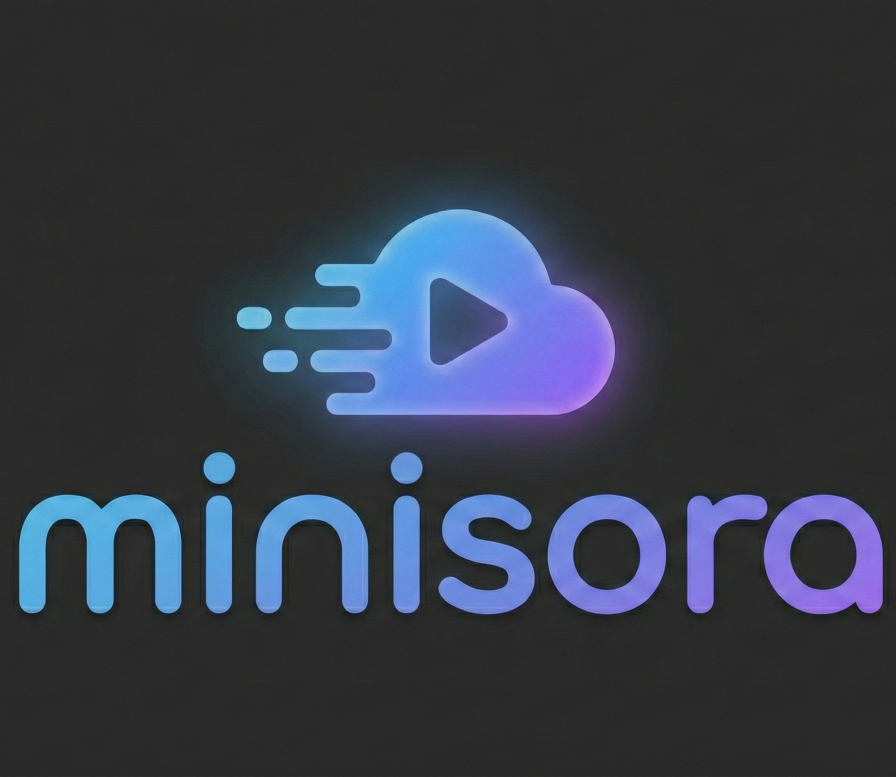
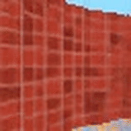
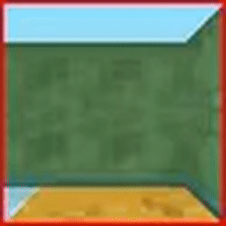

# minisora: OpenAI Sora 学習の最小かつスケーラブルな PyTorch 実装

<p align="center">

</p>

<p align="center">
<b>DiT による動画生成のミニマル & スケーラブルな PyTorch 実装</b>
</p>

<p align="center">
<a href="https://huggingface.co/ramu0e/minisora-dmlab">

</a>
<a href="https://github.com/YN35/minisora">

</a>
<a href="https://pytorch.org/">

</a>
<a href="https://www.google.com/search?q=LICENSE">

</a>
</p>

-----

## 📖 はじめに

**minisora** は、OpenAI Sora（Diffusion Transformers）に着想を得たトレーニングプロセスを、できるだけシンプルに、かつスケール可能な形で再実装した PyTorch プロジェクトです。巨大な動画生成コードベースにありがちな複雑さを取り除きつつ、マルチノード・マルチ GPU での学習にも対応できることを目指しています。

分散学習の効率化には **ColossalAI** を、推論部分には標準化されたインタフェースを提供する **Diffusers** を活用しています。

### ✨ 特徴

  * **🚀 スケーラブルな学習**: ColossalAI を利用し、マルチノード・マルチ GPU の分散学習に対応します。
  * **🧩 シンプルで学びやすい設計**: 研究用リポジトリでありがちなスパゲッティコードを避け、読みやすく・改造しやすい構成を目指しています。
  * **🎬 動画の継続生成**: テキストからの動画生成だけでなく、既存の動画クリップを拡張する「動画継続」（潜在空間でのオートレグレッシブな生成）にも対応しています。
  * **🛠️ モダンなツールチェイン**: 依存関係管理には `uv`、再現性の高い実行環境には Docker を利用します。

-----

## 🎥 デモ

<div align="center">
<table>
<tr>
<td align="center"><b>無条件生成</b></td>
<td align="center"><b>動画継続</b></td>
</tr>
<tr>
<td align="center"></td>
<td align="center"></td>
</tr>
</table>
</div>

-----

## 🏗️ アーキテクチャ概要

minisora は Latent Diffusion Transformer (DiT) を実装しています。動画の潜在表現をパッチの列として扱い、空間（高さ・幅）と時間（フレーム）の次元を注意機構（Attention）によって同時に処理します。


ライブラリは「モデル定義」と「学習ロジック」が分かれるように整理されています。

  * `minisora/models`: DiT 本体の実装とパイプラインロジック
  * `minisora/data`: DMLab / Minecraft 用のデータローダ
  * `scripts/`: 学習・推論のエントリポイント

-----

## ⬇️ モデル一覧

| モデル名 | データセット | 解像度 | フレーム数 | ダウンロード |
| :--- | :--- | :--- | :--- | :--- |
| **minisora-dmlab** | DeepMind Lab | $64 \times 64$ | 20 | [🤗 Hugging Face](https://huggingface.co/ramu0e/minisora-dmlab) |
| **minisora-minecraft** | Minecraft | $128 \times 128$ | 20 | *(Coming Soon)* |

-----

## 🚀 クイックスタート

### インストール

依存関係管理には、高速な Python パッケージマネージャである `uv` の利用を推奨します。

```bash
git clone https://github.com/YN35/minisora
cd minisora

# 開発ツール込みで依存関係をインストール
uv sync --dev
```

### 推論（Python）

Hugging Face に公開されている事前学習済み重みを利用して、動画潜在を生成できます。

```python
from minisora.models import DiTPipeline

# パイプラインの読み込み
pipeline = DiTPipeline.from_pretrained("ramu0e/minisora-dmlab")

# 推論の実行
output = pipeline(
    batch_size=1,
    num_inference_steps=28,
    height=64,
    width=64,
    num_frames=20,
)

# 潜在表現の取得（またはデコード）
latents = output.latents  # 形状: (B, C, F, H, W)
print(f"Generated video latents shape: {latents.shape}")
```

### デモの実行

```bash
# 無条件な動画生成
uv run scripts/demo/full_vgen.py

# 動画継続（最初のフレームを固定し、残りを生成）
uv run scripts/demo/full_continuation.py
```

-----

## 🏋️ 学習

minisora では、再現性の高いワークフローを提供するため、コンテナベースでの実行を想定しています。

### 1. 環境構築（Docker）

開発用コンテナを起動します。

```bash
docker compose up -d
```

> **Tip:** ローカルのデータディレクトリをマウントしたい場合は、`docker-compose.override.yml` を編集してください:
>
> ```yaml
> services:
>   minisora:
>     volumes:
>       - .:/workspace/minisora
>       - /path/to/your/data:/data
> ```

### 2. データセットの準備

サンプルデータセット（DMLab または Minecraft）をデータディレクトリにダウンロードします。

```bash
# 例: DMLab データセットのダウンロード
uv run bash scripts/download/dmlab.sh /data/minisora

# 例: Minecraft データセットのダウンロード
uv run bash scripts/download/minecraft.sh /data/minisora
```

### 3. 学習ジョブの実行

学習は `torchrun` 経由で起動します。以下はシングルノード・単一 GPU 用の例です。

```bash
# 使用する GPU ID を指定
export CUDA_VISIBLE_DEVICES=0

# 学習の開始
nohup uv run torchrun --standalone --nnodes=1 --nproc_per_node=1 \
  scripts/train.py --dataset_type=dmlab > outputs/train.log 2>&1 &
```

学習の進捗は `outputs/train.log` を確認してください。`--dataset_type` を `minecraft` に変更することで Minecraft データセットで学習できます。

-----

## 🗓️ Todo & ロードマップ

  - [x] 基本的な DiT 実装
  - [x] Diffusers パイプラインとの統合
  - [x] ColossalAI によるマルチノード学習
  - [x] 動画継続（Video Continuation）対応

-----

## 🤝 謝辞

  * **[ColossalAI](https://github.com/hpcaitech/ColossalAI)**: 分散学習をシンプルにしてくれる素晴らしいフレームワークに感謝します。
  * **[Diffusers](https://github.com/huggingface/diffusers)**: 強力で柔軟な Diffusion パイプライン実装に感謝します。
  * **[DiT 論文](https://arxiv.org/abs/2212.09748)**: 「Scalable Diffusion Models with Transformers」に多くのアイデアを得ています。

-----

## 📄 ライセンス

本プロジェクトは MIT ライセンスのもとで公開されています。詳細は [LICENSE](https://www.google.com/search?q=LICENSE) を参照してください。

